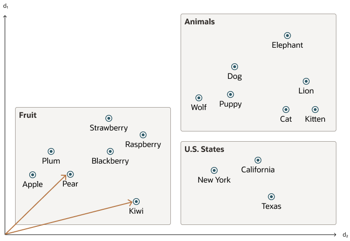
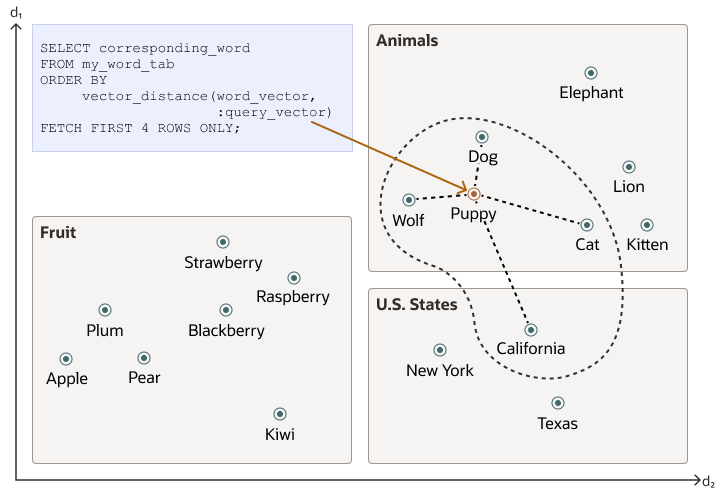
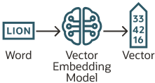
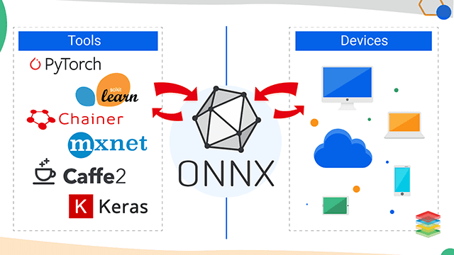

# Vector Search Overview

Oracle Database 23ai introduces powerful new capabilities for working with vector data and AI-powered search, with
Oracle AI Vector Search being a key component.

## `VECTOR` Data Type

The `VECTOR` data type was introduced in Oracle Database 23ai, and allows us to
store vector embeddings alongside other business data, in an Oracle relational database.

See the following basic example of using the VECTOR data type in a table definition:

```sql
CREATE TABLE docs
(
    doc_id     INT,
    doc_text   CLOB,
    doc_vector VECTOR
);
```

## Vector Embeddings

Vector Embeddings are numerical representations of data (video, images, audio, etc), based on meaning and context.



We can generate vector embeddings either outside or within the Oracle Database:

- Within the Oracle Database (ONNX Embedding Machine Learning Models)
- Outside the Oracle Database (Open-Source Transformer Models, 3rd Party REST APIs)

Embeddings can be used to represent almost any kind of data, and are commonly used in proximity searches.

## Similarity Search

Vector data is usually:

- Unevenly distributed
- Clustered

Doing a **similarity search** based on a given query vector is equivalent to: _Retrieving the k nearest vectors to
the query vector in a vector space._

When doing a similarity search, the relative order of distances is what really matters rather than the actual distance.



Similarity searches tend to get data from one or more clusters depending on the value of the query vector and the
fetch size.

## Vector Embedding Models

Vector Embedding models allow us to:

- Quantify features or dimensions



Most modern vector embeddings use a transformer model to generate embeddings, although convolutional neural networks
can also be used.

Depending, on the type of your data, you can use different pretrained open-source models in order to generate vector
embeddings, such as:

1. **Textual Data**: _Sentence Transformers_
2. **Visual Data**: _Residual Neural Network (ResNet)_
3. **Audio Data**: _Visual Spectogram_

Each model also determines the number of dimensions for each vector.

## Importing Embedding Models

Although, it is possible to generate one's own vector embeddings outside the Oracle Database, either using
pretrained open-source embedding models or calling REST APIs, there is also the possibility of importing these models
directly into the Oracle Database, as long as they are compatible with the **Open Neural Network Exchange - ONNX**
standard.



Oracle implements a ONNX runtime directly within the database, which allows us to generate vector embeddings directly
within the database by using SQL.
