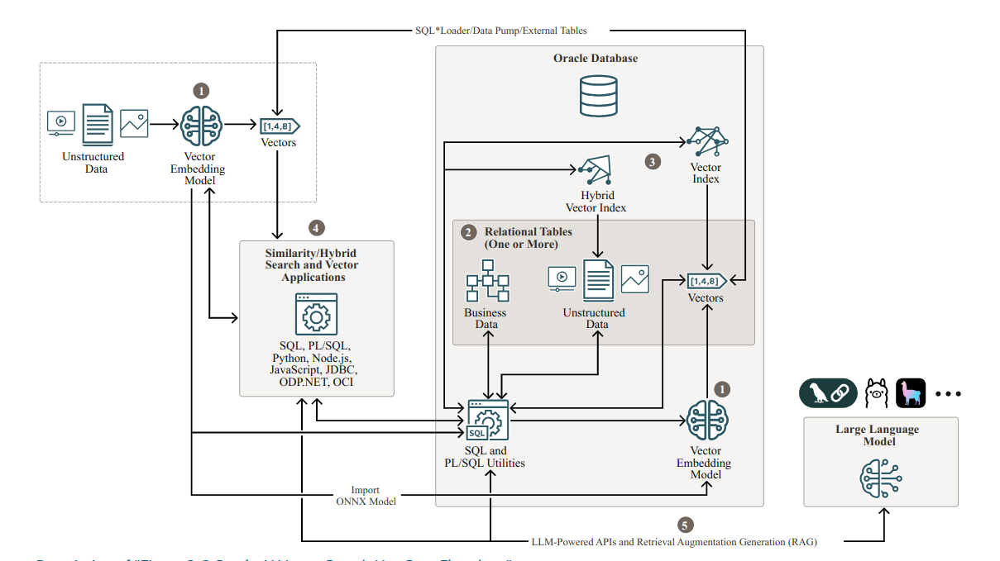

# Vector Search Workflow



Oracle AI Vector Search is designed for Artificial Intelligence workloads. It allows us to query data based on
semantics and image similarity rather than simple keywords. The preceding diagram shows us the possible steps
one must take in order to manage vector embeddings with Oracle AI Vector Search.
The primary workflow steps are:

1. Generate Vector Embeddings
2. Store Vector Embeddings
3. Create Vector Indexes / Hybrid Vector Indexes
4. Query Data with Similarity Search
5. Full RAG Inference

## 1. Generate Vector Embeddings

Oracle AI Vector Search offers several utilities to automatically generate vector embeddings from unstructured
data, either within or outside the Oracle Database.

To generate embeddings within the database, you can import and use vector embedding models in ONNX format.
To generate embedding models outside the database, you can access third-party vector embedding models (remotely or
locally) by calling third party REST APIs.

## 2. Store Vector Embeddings

We can store vector embeddings by creating columns of the `VECTOR` data type, which will allows us to store our
unstructured data alongside relational business data, within our database tables.

The following commands shows us a simple example of creating a database table with a `VECTOR` column:

```sql
CREATE TABLE MY_DATABASE_TABLE
(
    id        NUMBER,
    embedding VECTOR
);
```

In this example, we do not specify the number of dimensions or their format, which are both optional, and allows us to
enter vectors of different dimensions with different formats.

Here's another example which imposes more constraints on what you can store

```sql
CREATE TABLE my_vectors
(
    id        NUMBER,
    embedding VECTOR(768, INT8)
);
```

In this example, each vector that is stored:

- Must have 768 dimensions
- Each dimension will be formatted as an `INT8`.

## 3. Create Vector Indexes

This is considered an optional step. Depending on whether to use similarity search or hybrid search, you can create
either a vector index or a hybrid vector index.

- **Vector Indexes**: Specialized indexing data structures which are designed to accelerate similarity searches using
  high-dimensional vectors. It is advised to create vector indexes on your vector embeddings in order to drastically
  reduces the search space, thereby making the similarity search process extremely efficient.
- **Hybrid Vector Indexes**: Leverages the Oracle Text indexing data structure as well as the vector indexing data
  structures. Such indexes can provide more relevant search results by integrating the keyword matching capabilities
  of text search with the semantic precision of vector search (combination of _full-text search_ and _similarity
  search_).

## 4. Query Data - Similarity Search

This step allows us to use Native SQL operations as well as combining both similarity searches with relational searches
in order to retrieve relevant data.

There are several types of similarity searches allowed in Oracle AI Vector Search, such as:

- Exact Similarity Search
- Approximate Similarity Search
- Multi-Vector Similarity Search
- Hybrid Search

## RAG Inference

You can use vector utility PL/SQL APIs for prompting Large Language Models (LLMs) with textual prompts and images
using LLM-powered interfaces.

By providing an LLM with up-to-date facts from our company, we can minimize hallucinations.

**Retrieval Augmented Generation** (RAG) is an ideal approach developed to address the limitations of Large Language
Models, which combines the strengths of pretrained language models, with the ability to retrieve information from a
database in real time during the generation of responses.

We can do this step by leveraging the power of Oracle AI Vector Search and LLM Integration of popular frameworks such
as LangChain, Ollama or LlamaIndex.