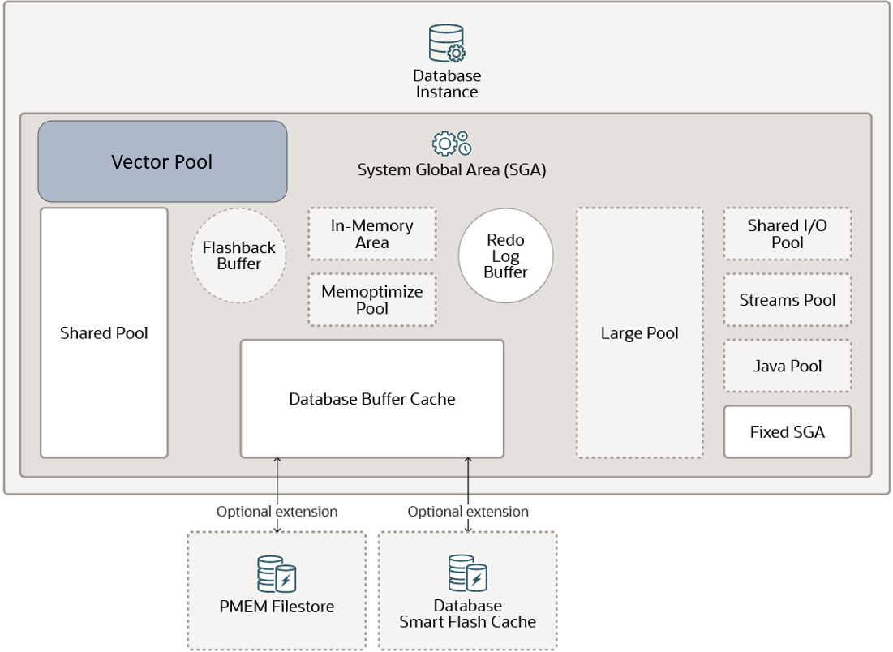

# Vector Indexes and Memory

## Vector Indexes

Are a specialized indexing data structure which can make queries more efficient against vectors. They use techniques
such as:

- Clustering
- Partitioning
- Neighbor Graphs

They greatly reduce the search space, which causes our queries to happen quicker. They are also extremely efficient
as well.
They do require us to enable the Vector Pool in the SGA (System Global Area - a shared memory region that stores data
and control information from an Oracle Database instance).

Oracle AI Vector Search supports two types of indexes:

- **In-Memory Neighbor Graph Vector Index**: **Hierarchical Navigable Small World** (_HNSW_) is the only type of
  In-Memory Neighbor Graph Vector Index supported. HNSW graphs are very efficient indexes for vector approximate
  similarity search.
- **Neighbor Partition Vector Index**: **Inverted File Flat** (_IVF_) vector index is the only type of Neighbor
  Partitioning Vector Index supported. IVF is a partition-based index that lets us balance high-search quality with
  reasonable speed.

### The SGA Vector Pool



For us to use vector indexes, it is a MUST to enable the Vector Pool in the Oracle SGA. The Vector Pool is a
new component of the Oracle Database SGA which allows us to store vector indexes.

In order to enable the Vector Pool in the SGA, all we need to do is set the `VECTOR_MEMORY_SIZE` parameter. We can set
it at:

- **CDB - Container Database Level**: Specifies the current size of the Vector Pool.

```oraclesqlplus
ALTER SYSTEM SET VECTOR_MEMORY_SIZE=1G SCOPE = BOTH;
```

```oraclesqlplus
ALTER SYSTEM SET VECTOR_MEMORY_SIZE = 512M SCOPE=SPFILE
```

- **PDB - Pluggable Database Level**: Specifies the maximum Vector Pool usage allowed by a PDB. Inherits from the CDB.

Other considerations from the Vector Pool are:

- Vector indexes are stored in this pool.
- Vector metadata is also stored in this pool.
- You need to bounce (restart) the database.
- Large vector indexes need a lot of RAM.
- RAM constraints the vector index size.
- It is advised to use IVF indexes when there is not enough RAM, as they use the _buffer cache + disk_.

## Memory Considerations

- Most popular vectors are between 1.5 and 12`KB` in size.
- Oracle AI Vector Search supports `INT8`, `FLOAT32` and `FLOAT64` formats for vectors.

### Vector Storage

- Vectors are stored in tables.
- Table data is stored on disk.

| `ID` | `NAME`   | `AGE` | `CITY`        | `VECTOR_EMBEDDING` |
|------|----------|-------|---------------|--------------------|
| 1    | Sally    | 29    | San Francisco | [3.1, 0.7, -1.8]   |
| 2    | Marcus   | 42    | Munich        | [2.6, 3.5, -1.2]   |
| 3    | Anika    | 25    | Chennai       | [2.7, 1.6, -0.8]   |
| 4    | Benjamin | 49    | New York      | [1.2, 7.7, 2.8]    |
| 5    | Ranjan   | 31    | Mumbai        | [4.1, 9.3, 0.2]    |
| 6    | Xiang    | 56    | Beijing       | [0.5, 5.6, 1.5]    |
| 7    | JaeYeop  | 28    | Seoul         | [3.6, 2.7, 0.6]    |
| 8    | Carlos   | 33    | Monte Video   | [2.3, 2.4, -1.2]   |

### In-Memory Neighbor Graph Indexes

- Stored in memory + on disk
- The in-memory size is: **1.3** * _size of vector format_ * _number of dimensions_ * _number of rows*
- This memory is allocated from the SGA.

| Constant | Size of vector format | Dimensions | Rows      | GB   |
|----------|-----------------------|------------|-----------|------|
| 1.3      | 4                     | 384        | 1,000,000 | 1.9  |
| 1.3      | 4                     | 768        | 1,000,000 | 3.7  |
| 1.3      | 4                     | 1024       | 1,000,000 | 5.0  |
| 1.3      | 4                     | 1536       | 1,000,000 | 7.4  |
| 1.3      | 4                     | 3072       | 1,000,000 | 15.0 |

**NOTE**: 1.3 is an approximation for the overhead and graph layers.
