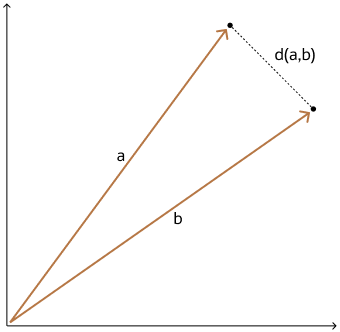
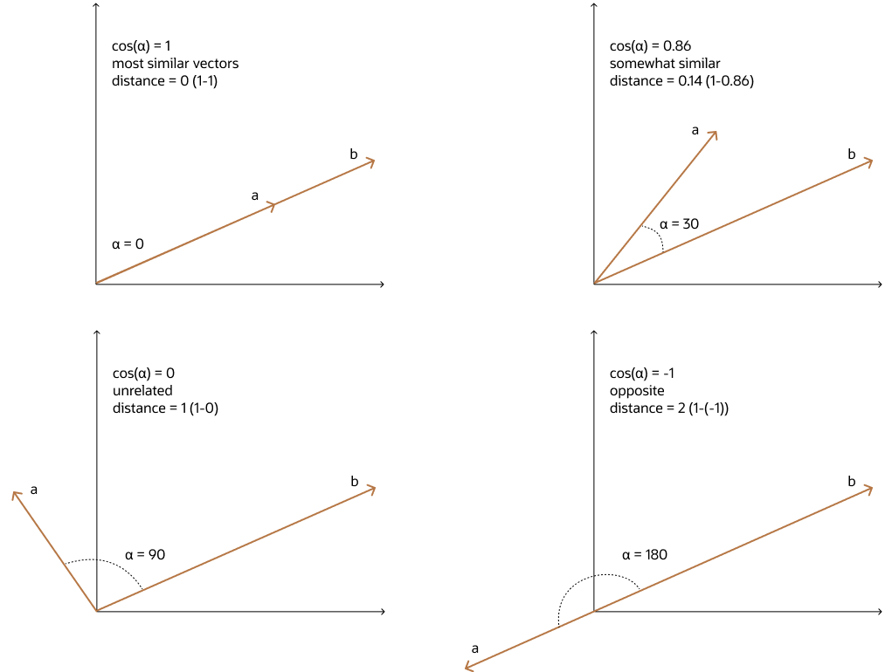
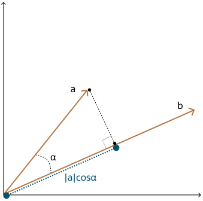
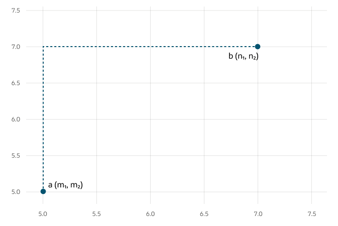
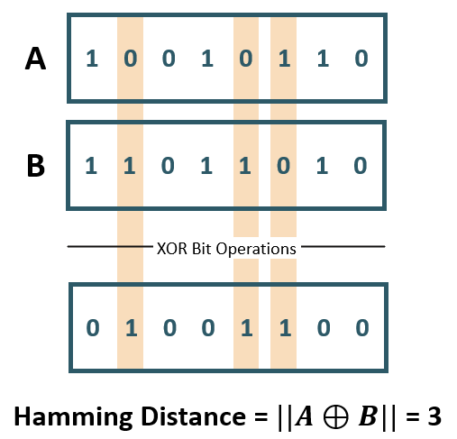
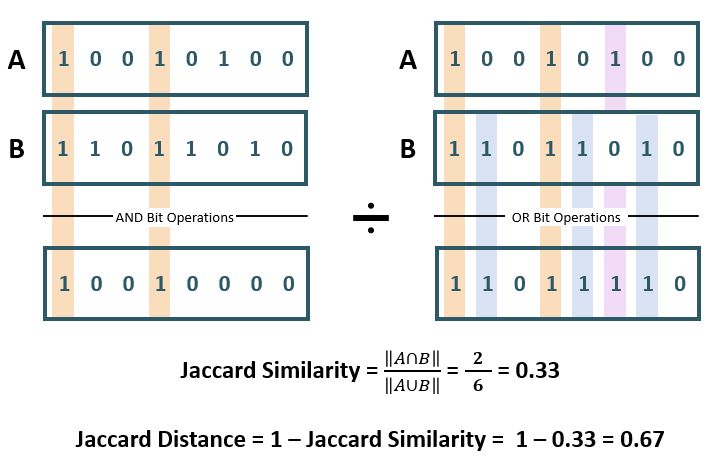

## Finding the Nearest Vectors

## Vector Constructor

The vector constructor is a function which allows us to create vectors without having to store them inside the column
of a table.

These are useful for learning purposes and are generally used with a small number of dimensions (as most embedding
models contain thousands of different dimensions).

It also allows us to specify the vector values.

- Dimension is OPTIONAL.
- Format is OPTIONAL.

Example:

```oracle
SELECT VECTOR('[0, 0]');
```

```oracle
SELECT VECTOR('[1, 2, 3]', 3, INT8);
```

## Vector Distance Operand

The Vector Distance Operand allows us to use the main function: **`VECTOR_DISTANCE``**, which takes two vectors as
parameters (metric is optional, defaults to `COSINE`).

Distances available:

- `VECTOR_DISTANCE`
- `COSINE_DISTANCE`
- `L1_DISTANCE`
- `L2_DISTANCE`
- `INNER_PRODUCT`

The vector distance function is used to perform a similarity search.

### Vector Distance Metrics

#### Euclidean and Euclidean Squared Distances

The **Euclidean Distance** refers to the straight-line distance between two vectors, computed by using the
Pythagorean theorem.
It is sensitive to both:

- Vector Size
- Vector Direction

The **Euclidean distance** between two vectors \( \mathbf{a} \) and \( \mathbf{b} \) in an \(n\)-dimensional space is
the straight-line distance, or the "as-the-crow-flies" distance. It's calculated as:

\[
d(\mathbf{a}, \mathbf{b}) = \sqrt{\sum_{i=1}^{n} (a_i - b_i)^2}
\]

Where:

- \( a_i \) and \( b_i \) are the components of vectors \( \mathbf{a} \) and \( \mathbf{b} \), respectively.
- \( n \) is the number of dimensions of the vectors.

The result is a **non-negative real number** representing the distance between the points in the vector space.

With Euclidean distances, comparing squared distances is equivalent to comparing distances. So, when ordering is
more important than the distance values themselves, the Squared Euclidean distance is very useful as it is faster
to calculate than the Euclidean distance (avoiding the square-root calculation).

```oracle
-- Using the Vector Distance function
SELECT TO_NUMBER(VECTOR_DISTANCE(
        VECTOR('[0, 0]'),
        VECTOR('[10, 0]'),
        EUCLIDEAN
                 )) AS DISTANCE;

-- Using the L2 Distance function, syntactic sugar for VECTOR_DISTANCE(v1, v2, EUCLIDEAN)
SELECT TO_NUMBER(L2_DISTANCE(
        VECTOR('[0, 0]'),
        VECTOR('[10, 0]')
                 )) AS DISTANCE;

-- Using shorthand operator <->, which represents Euclidean Distance
SELECT TO_NUMBER(VECTOR('[0, 0]') <-> VECTOR('[10, 0]')) AS DISTANCE;
```

The **Euclidean squared distance** is simply the square of the Euclidean distance. It eliminates the square root in the
formula and is given by:

\[
d^2(\mathbf{a}, \mathbf{b}) = \sum_{i=1}^{n} (a_i - b_i)^2
\]

This is often used in machine learning and search algorithms because:

- **Computational efficiency**: Removing the square root makes the calculation cheaper in terms of computation,
  especially when performing many comparisons, avoiding the square root calculation.
- **Comparison purposes**: If you only care about relative distances (i.e., which is closer or farther), the square root
  doesn’t change the ranking order of distances.

```oracle
-- Using the Vector Distance function
SELECT TO_NUMBER(VECTOR_DISTANCE(
        VECTOR('[0, 0]'),
        VECTOR('[10, 0]'),
        EUCLIDEAN_SQUARED
                 )) AS DISTANCE
```



#### Cosine Similarity

One of the **most widely used similarity metrics**, especially in natural language processing (NLP). The **smaller the
angle, the more similar** two vectors are considered.

Cosine similarity measures the similarity in the direction or angle of the vectors, ignoring differences in their
size (also called _magnitude_). The smaller the angle, the bigger its cosine. So the cosine distance and the cosine
similarity have an inverse relationship.

While cosine distance measures how different two vectors are, cosine similarity measures how similar two vectors are.

```oracle
-- Using the Vector Distance function
SELECT TO_NUMBER(VECTOR_DISTANCE(
        VECTOR('[3, 5]'),
        VECTOR('[10, 0]'))) AS DISTANCE;

-- Using shorthand operator <=>, which represents Cosine Distance.
SELECT TO_NUMBER(VECTOR('[3, 5]') <=> VECTOR('[10, 0]')) AS DISTANCE;
```

Note: As mentioned before, the `VECTOR_DISTANCE` function defaults to `COSINE`, so it can be omitted from the
function arguments.



#### Dot Product Similarity

Multiplies the size of each vector by the cosine of their angle, which is also equivalent to the sum of the vector
coordinates.

**Larger means more similar, smaller means less similar**.

```oracle
-- Using the Vector Distance function
SELECT -1 * TO_NUMBER(VECTOR_DISTANCE(
        VECTOR('[3, 5]'),
        VECTOR('[10, 0]'),
        DOT)) AS DISTANCE;

-- Using Inner Product
SELECT TO_NUMBER(INNER_PRODUCT(
        VECTOR('[3, 5]'),
        VECTOR('[10, 0]'))) AS DISTANCE;

-- Using shorthand operator <#>, which represents Negative Dot Product = -1*INNER_PRODUCT(v1, v2).
SELECT -1 * TO_NUMBER(VECTOR('[3, 5]') <#> VECTOR('[10, 0]')) AS DISTANCE;
```



#### Manhattan Distance

Useful for describing uniform grids:

- City Blocks
- Power Grids
- Chessboard

Faster than the Euclidean metric. Useful for vectors describing objects in uniform grids such as city blocks, power
grids or perhaps a chessboard.



#### Hamming Similarity

The **Hamming distance** between two vectors represents the number of dimensions where they differ.

For Binary Vectors, they describe:

- Number of bits which require change to match

Hence, they compare the position of each bit in the sequence and are used for error detection over networks.



#### Jaccard Similarity

Is used to determine the number of significant non-zero dimensions common between `BINARY` vectors.

The Jaccard similarity is only applicable to `BINARY` vectors and only the non-zero bits of each vector are considered.



## Shorthand Operators

- `<->` **Euclidean Distance Operator**
    - Equivalent to `L2_DISTANCE(expr1, expr2)` or `VECTOR_DISTANCE(expr1, expr2, EUCLIDEAN)`.
- `<=>` **Cosine Distance Operator**
    - Equivalent to `COSINE_DISTANCE(expr1, expr2)` or `VECTOR_DISTANCE(expr1, expr2, COSINE)`.
- `<#>` **Negative Dot Product Operator**
    - Equivalent to `-1*INNER_PRODUCT(expr1, expr2)` or `VECTOR_DISTANCE(expr1, expr2, DOT)`.

