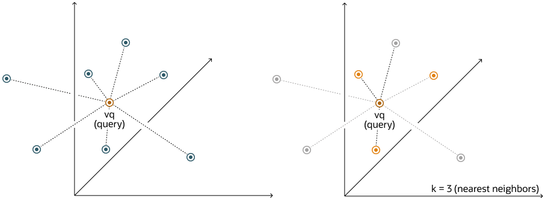

# Finding the Closest Vectors

## Nearest Neighbor Search

The goal is to find the closest vector(s) to a given **query vector**, based on a distance or similarity metric (like
Euclidean, cosine, Jaccard, etc.).

It can be either an exact search or an approximate search.



## Exact Similarity Search

A type of nearest neighbor search where the search results are guaranteed to be correct - i.e., the true nearest
neighbors to the query vector. It involves checking every possible vector (brute force or optimally indexed) which
ensures 100% accuracy but is slow for large datasets due to exhaustive comparisons.

Calculates the query vector distance to all other vectors. Also called _flat search_.
This gives us:

- Most accurate results
- Perfect search quality
- But involves potentially significant search times

These comparisons are done using a particular distance metric.

Here's an example of Exact Similarity search using the Euclidean distance metric:

```oracle
SELECT docId
FROM vector_tab
ORDER BY VECTOR_DISTANCE(embedding, :query_vector, EUCLIDEAN)
FETCH EXACT FIRST 10 ROWS ONLY;
```

## Approximate Similarity Search

Approximate similarity search uses vector indexes. To use vector indexes, it is required to have enabled the
vector pool in the SGA.

These types of searches:

- Can be more efficient than exact similarity search.
- Tend be less accurate
- Uses target accuracy

Remember, we have two types of vector indexes:

- HNSW (Hierarchical Navigable Small World) Index

```oracle
-- Creating a HNSW vector index
CREATE
VECTOR INDEX galaxies_hnsw_idx 
       ON galaxies(embedding)
       ORGANIZATION INMEMORY NEIGHBOR GRAPH
       DISTANCE COSINE
WITH TARGET ACCURACY 95;

SELECT name
FROM galaxies
WHERE name <> 'NGC1073'
ORDER BY VECTOR_DISTANCE(embedding, TO_VECTOR('[0, 1, 1, 0, 0]'), COSINE)
    FETCH APPROXIMATE FIRST 3 ROWS ONLY;
```

- IVF (Inverted File Flat) Index

```oracle
-- Creating a HNSW vector index
CREATE
VECTOR INDEX galaxies_ivf_idx 
       ON galaxies(embedding)
       ORGANIZATION NEIGHBOR PARTITIONS
       DISTANCE COSINE
WITH TARGET ACCURACY 95;

SELECT name
FROM galaxies
WHERE name <> 'NGC1073'
ORDER BY VECTOR_DISTANCE(embedding, TO_VECTOR('[0, 1, 1, 0, 0]'), COSINE)
    FETCH APPROXIMATE FIRST 3 ROWS ONLY;
```

## Multi-Vector Similarity Search

Multi-vector similarity search is usually used for multi-document search. 
- Documents are split into chunks.
  - Chunks embedded individually into vectors.
- Uses partitions

A multi-vector search consists of retrieving the top K vector matches using the partitions based on the document's
characteristics.

The ability to score documents based on the similarity of their chunks to a query vector being 
searched is facilitated in SQL using the partition row-limiting clause.

Using exact similarity search:
```oracle
SELECT bookId, paragraphId, sentence
FROM books
ORDER BY VECTOR_DISTANCE(sentence_embedding, :sentence_query_vector)
FETCH FIRST 2 PARTITIONS BY bookId, 3 PARTITIONS BY paragraphId, 4 ROWS ONLY;
```

Using approximate similarity search:
```oracle
SELECT bookId, paragraphId, sentence
FROM books
ORDER BY VECTOR_DISTANCE(sentence_embedding, :sentence_query_vector)
FETCH APPROXIMATE FIRST 2 PARTITIONS BY bookId, 3 PARTITIONS BY paragraphId, 4 ROWS ONLY 
WITH TARGET ACCURACY 90;
```
