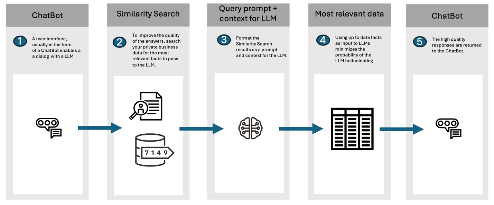
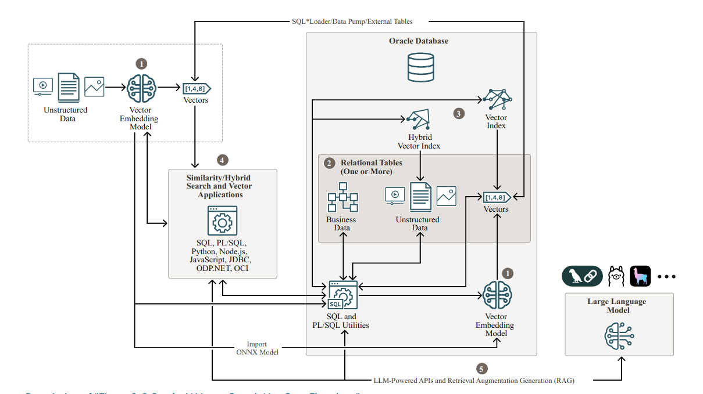

# RAG—Retrieval Augmented Generation: Overview

## What is RAG and what are the benefits?

- Technique for enhancing LLMs.
- Store vector data alongside business data.
- Generate more accurate and informative responses.
- Context-aware response.

Real-world applications, include QA (question / answers), chatbot development, context summarization and knowledge
discovery, benefit immensely from RAG.



## Vector Search Workflow

1. Generate Vector Embeddings
2. Store Vector Embeddings
3. Create Vector Indexes
4. Query Data with Similarity Searches
5. RAG Inference



## Interact with your favorite LLM | Complete the RAG pipeline


Interact with LLMs from AI model providers such as Open-AI, Cohere, Google, and OCI Generative AI  

`UTL_TO_SUMMARY()` for summarization tasks  
➢ Can use Oracle Text gist summarization as well  

`UTL_TO_GENERATE_TEXT()` for having conversations with the LLM  


```oracle
DBMS_VECTOR.CREATE_CREDENTIAL('OPENAI_CRED', auth_params);

model_params := '{**  
  "provider": "openai",  
  "credential_name": "OPENAI_CRED",  
  "url": "https://api.openai.com/v1/chat/completions",  
  "model": "gpt-40-mini",  
  "temperature": 1.0}'  


DBMS_VECTOR_CHAIN_UTL_TO_GENERATE_TEXT('What is RAG?', json(model_params));
```

Ollama support for customer-managed LLMs*  

*Coming Soon!  
