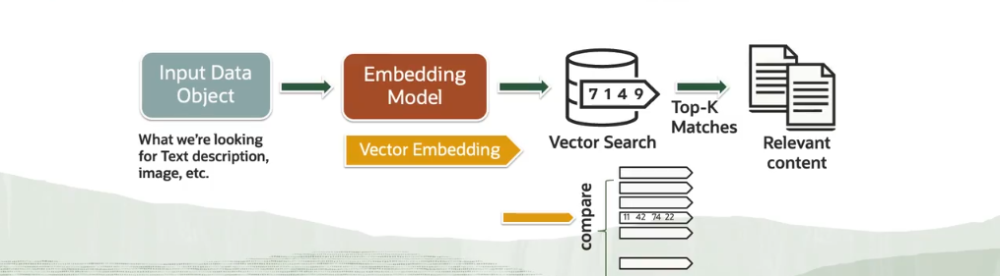

# Embedding Models

## Oracle AI Vector Search Embeddings

- AI Vector Search is based on the Similarity property.
- Search Data by Semantic Similarity rather than by values.
- Vector embeddings are created by the embedding models to represent the unstructured data.



## `VECTOR_EMBEDDING()`

- New function to generate vectors within the database.
- Supports the Open Neural Network Exchange (ONNX) framework.
- Allows us to generated embeddings from unstructured data using the imported model.

```oracle
-- Importing a ONNX model: the ONNX-ported version of the sentence-transformers/all-MiniLM-L6-v2 for 
-- generating text embeddings. (https://huggingface.co/onnx-models/all-MiniLM-L6-v2-onnx)
DBMS_DATA_MINING.import_onnx_model(
    model_name => "All-MiniLM-L6-v2",
    model_data => "All-MiniLM-L6-v2.onnx"
);

-- Creating a vector embedding using the imported model
SELECT VECTOR_EMBEDDING(All-MiniLM-L6-v2 USING incident_text)
FROM support_incidents;
```

## Using Embedding Models with Oracle AI Vector Search (Steps)

1. Create and set up a table (Use some python program `create_schema.py`)
2. Vectorize a table (Use some program `vectorize_table_SentenceTransformers.py` which uses the SentenceTransformers
embedding model)
3. Perform similarity search with Sentence Transformers (in some program `similarity_search_SentenceTransformers.py`).
4. (**OPTIONAL**) Changing the embedding model.
   1. Re-vectorize the table using `vectorize_table_SentenceTransformers.py`.
   2. Use the new model with different words and compare/review the results.


