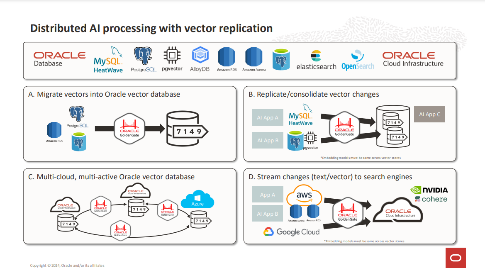

# Oracle AI Vector Search Supporting Features

## Exadata: AI Storage

- **Exadata**: A high-performance engineered system combining optimized hardware (storage, compute) and Oracle Database
  software.

With the release of Exadata 24ai release, Oracle Exadata has ushered in a new era of AI capabilities, such as:

- AI Smart Scan
- In-memory Columnar Speed JSON Queries
- Transparent Cross-Tier Scan
- Caching Enhancements

## GoldenGate: Distributed AI

- **GoldenGate**: A real-time data replication and integration tool for heterogeneous systems.

There are many new features and enhancements in Oracle GoldenGate 23ai:

- Next-generation AI with distributed vector support.
- Integration with StatsD and Telegraf for monitoring and metrics.
- Non-Oracle & Big Data technology.
- High-availability clusters.
- 30+ new OS/DB certifications.

## Data Pump and SQL Loader

- **Data Pump**: Bulk import/export of structured data between Oracle Datasets.
- **SQL Loader**: Loads external data (CSVs, logs, etc) into Oracle Database.

**Oracle SQL Loader** now allows you to load vectors into databases.
**Oracle Data Pump** also allows you to unload and load vector data using Oracle Data Pump, and supports vector
columns in various Data Pump modes.