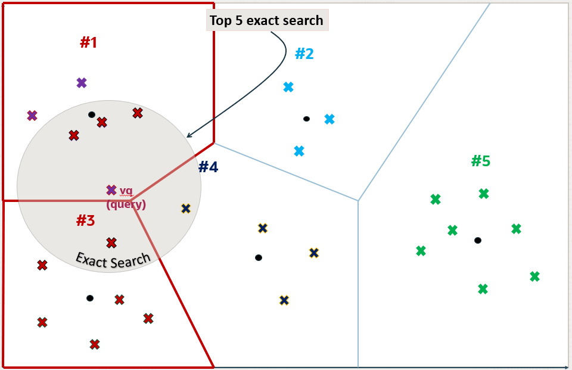

<a name="readme-top"></a>
<br />
<div align="center">
  <a href="#">
   <!-- Replace this logo for a custom official logo -->
    
  </a>

<h1 align = "center">
<b><i>Oracle AI Vector Search</i></b>
</h1>
    <!-- Add/Remove categories depending on your project -->
  <p align="center">
    Solutions & Materials from Oracle AI Vector Search Certification
    <br />
    <!-- IMPORTANT NOTE: If you want to append emojis you'll need to add the '-' sign before and after the header, as shown below:  -->
    <a href="#-structure-">Structure</a>
    ·
    <a href="#-modules-">Modules</a>
    ·
    <a href="#-requirements-">Requirements</a>
    ·
    <a href="#-license-">License</a>
  </p>
</div>

This repository contains my scripts, answers & solutions to the Oracle MyLearn Training for the
Oracle AI Vector Search Professional Certification.

## 📁 Structure 📁

This is the general top level directory structure of this repository:

```txt
├───.github
│   ├─── ...
├───01-oracle-ai-vector-search-fundamentals
│   ├─── ...
├───02-oracle-ai-vector-search-deep-dive
│   ├─── ...
├───03-autonomous-database-select-ai
│   ├─── ...
├───assets
│   ├─── ...
```

## ⏳ Deadlines ⏳

| ID | Module                               | Progress | Deadline   | 
|----|--------------------------------------|----------|------------|
| 1  | Oracle AI Vector Search Fundamentals | :x:      | 20/04/2025 |
| 2  | Oracle AI Vector Search Deep Dive    | :x:      | 27/04/2025 |
| 3  | Autonomous Database Select AI        | :x:      | 04/05/2025 |
| 4  | Practice Exam                        | :x:      | 11/05/2025 |
| 5  | Certification Exam                   | :x:      | 13/05/2025 |

## 🚀 Modules 🚀

### [Module 1: Oracle AI Vector Search : Fundamentals](01-oracle-ai-vector-search-fundamentals)

* Oracle AI Vector Search Overview
* Oracle AI Vector Search Workflow
* Vector Queries
* Vector Indexes & Memory Considerations
* Vector DML & Vector DDL
* Nearest Vectors
* Closest Vectors
* Distance & Vector Functions

### [Module 2: Oracle AI Vector Search : Deep Dive](02-oracle-ai-vector-search-deep-dive)

* RAG Overview
* Using Embedding Models with Oracle AI Vector Search
* RAG with Oracle AI Vector Search and OCI Gen AI Service (Python)
* RAG with Oracle AI Vector Search and OCI Gen AI Service (PL/SQL)
* Oracle AI Vector Search Supporting Features

### [Module 3: Autonomous Database Select AI](03-autonomous-database-select-ai)

* RAG using Oracle Autonomous Database Select AI

### [Module 4: Practice Exam](04-practice-exam/)

* Practice Exam Questions & Solutions

<div align="center">

</div>

<p align="right">(<a href="#readme-top">back to top</a>)</p>


<!-- This is a custom version of the Read-My-README template, by Jon Areas, 
found at: https://github.com/jxareas/read-my-readme -->
